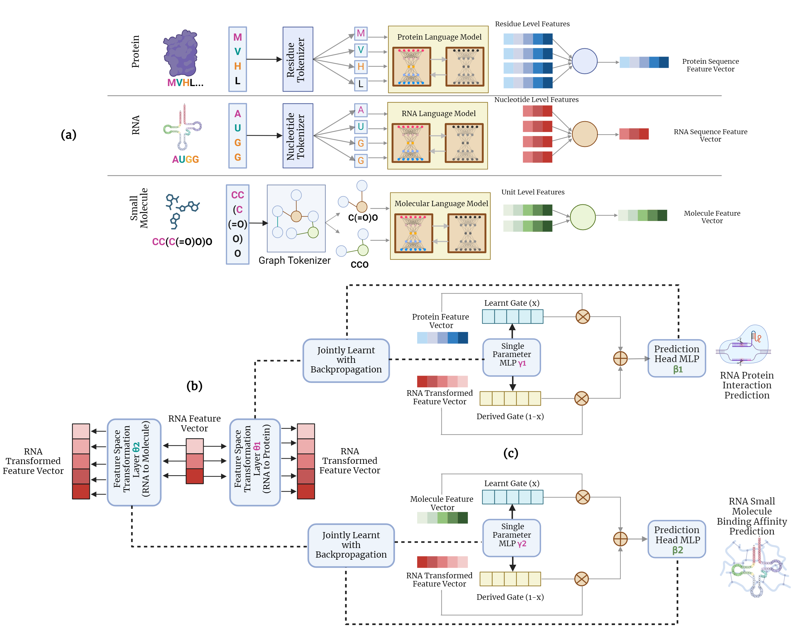

## BioLLMNet: Enhancing RNA-Interaction Prediction with a Specialized Cross-LLM Transformation Network

**BioLLMNet** is a unified, sequence-only deep learning framework for predicting RNA interactions across multiple modalities: RNA–protein, RNA–small molecule, and RNA–RNA. It leverages pretrained biological language models to extract contextualized embeddings and employs a novel **learnable gating mechanism** to dynamically fuse multimodal information.

### Model Architecture



### Installation

1. **Clone the repository**:
   ```bash
   git clone https://github.com/abrarrahmanabir/BioLLMNet.git
   cd BioLLMNet

### Dataset
All datasets used in this study can be found at:
https://drive.google.com/drive/folders/1qDX5u_5BgptB0Ah5o4-uEF91oSV4-7ci?usp=sharing

The datasets provided in this repository are already preprocessed and ready for training. They contain precomputed embeddings from the appropriate pre-trained language models (RiNALMo for RNA, ESM-2 for proteins, MoleBERT for small molecules) along with the corresponding labels. No further tokenization or embedding extraction is performed in the training scripts. Users can use these processed files directly or regenerate the language model embeddings from the raw sequences from the respective language models and save them in the pickle file to use in the training script.

### Usage
This repository includes three Jupyter notebooks, each corresponding to a specific interaction type:
- `rna_protein.ipynb`: RNA–Protein interaction prediction
- `rna_molecule.ipynb`: RNA–Small Molecule interaction prediction
- `rna_rna.ipynb`: RNA–RNA interaction prediction


